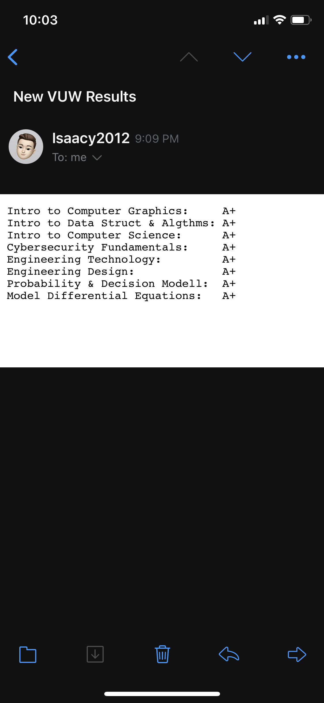

# GetGradeVUW
## Get results from VUW


<p float="left">
  
</p>

<b>Sends an email on new result</b>

GetGrade checks the ECS Assessment marks every 15-30 minutes (random to stop accidentally synchronizing and overloading the server if there are many users) to check if there is a new result. If there is, it uses your gmail account and sends you an email!

<b>Automatic login</b>

Automatically logs into the ECS Assessment Marks page by encrypting and storing your username and password.

<b>Active Hours</b>

Only check the site if within active hours. Set the active hours by editing "settings.ini" (generated after first run) and setting active_hours like so:

```
[SETTINGS]
email = ...
username = ...
password = ...
active_hours = 9-17

```

This settings.ini would mean that the active hours are between 9am and 5pm.

# Logging
Logging outputs to log.txt:

```
Successfully logged in with cookies!
Email sent at: 2021-06-17 22:11:01
=================NEW RESULTS=================
Intro to Computer Graphics:     A+
Intro to Data Struct & Algthms: A+
Intro to Computer Science:      A+
Cybersecurity Fundamentals:     A+
Engineering Technology:         A+
Engineering Design:             A+
Probability & Decision Modell:  A+
Model Differential Equations:   A+

=============================================
Sleeping for: 15.48 minutes, until 2021-06-17 22:26:32
```


